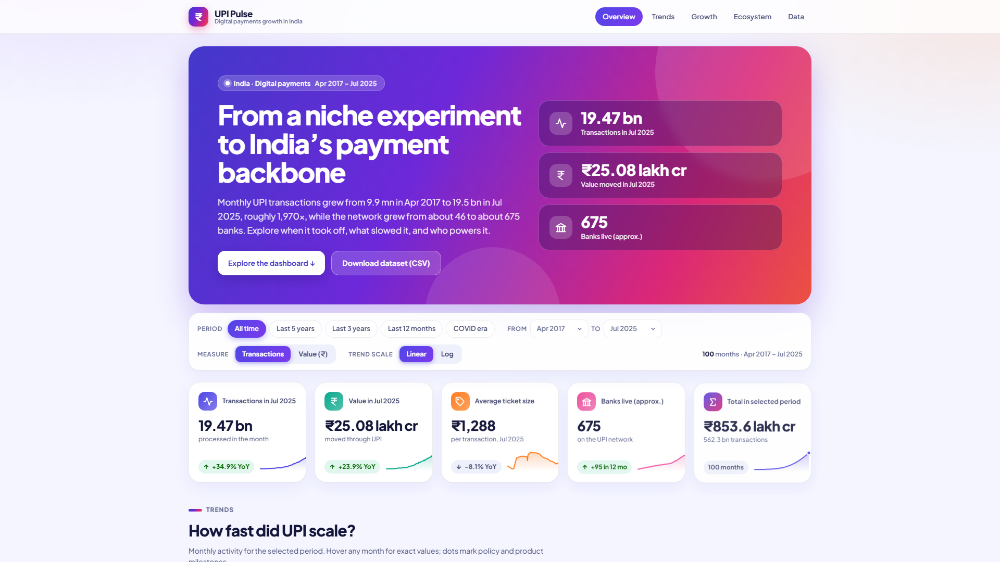
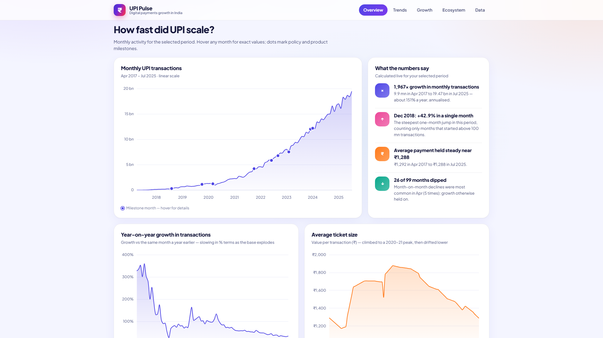
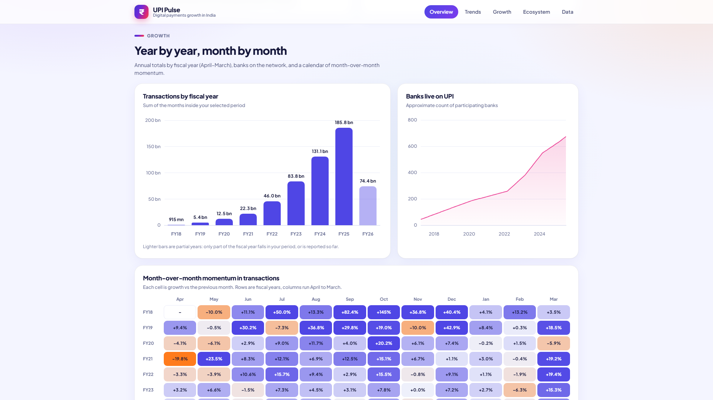

# UPI Pulse: Digital Payments Growth in India

An interactive dashboard and a 100-record dataset covering the growth of India's UPI payments, monthly from **Apr 2017 to Jul 2025**.

**Live demo:** [https://upi-pulse-digital-payments.vercel.app](https://upi-pulse-digital-payments.vercel.app)



<table>
  <tr>
    <td></td>
    <td></td>
  </tr>
</table>

## Highlights

- Monthly UPI transactions grew from about **9.9 million (Apr 2017)** to **19.47 billion (Jul 2025)**, roughly 1,970 times higher.
- FY25 recorded about **185.85 billion transactions worth Rs 260.6 lakh crore**.
- Year-on-year growth has eased from above 300% (2019) to about 35% (Jul 2025) as the base grew.
- Average payment size peaked near Rs 1,878 (Oct 2020) and has drifted down to about Rs 1,288.

## Dashboard features

- **Filters:** period presets (all time, last 5 years, last 3 years, last 12 months, COVID era), custom from/to months, a Transactions or Value measure, and a linear or log scale for the trend chart. Every chart, KPI, insight and the table re-render for the selected period.
- **KPI cards** with sparklines and year-on-year change.
- **Charts:** monthly trend with milestone markers, year-on-year growth, average ticket size, fiscal-year totals, banks live, a month-over-month heatmap, and app share.
- **Live insights** calculated from the selected period.
- **Data table** with search, column sorting and CSV export of the current view.
- Responsive layout, colour-blind-safe palette, and the table doubles as an accessible alternative to the charts.

## Run it locally

No install is needed for the dashboard.

```bash
git clone https://github.com/asutoshdesai111-del/upi-digital-payments-growth-india.git
cd upi-digital-payments-growth-india
```

Then open `dashboard/index.html` in any modern browser (double-click it, or run one of these):

```powershell
# Windows PowerShell
Start-Process ".\dashboard\index.html"
```
```bash
# macOS / Linux
open dashboard/index.html        # macOS
xdg-open dashboard/index.html    # Linux
```

To serve it over a local address instead, run this from the project folder and browse to <http://localhost:8000/dashboard/>:

```bash
python -m http.server 8000
```

## Project structure

```
.
|-- README.md
|-- build_dataset.py            builds and validates the dataset
|-- vercel.json                 opens the live site on /dashboard/
|-- UPI_Pulse_Project_Report.pdf  full project report and run guide
|-- data/
|   |-- upi_monthly.csv         100 monthly records (main dataset)
|   `-- upi_app_share.csv       approximate app share (Dec 2022 / 2023 / 2024)
|-- dashboard/
|   |-- index.html              open this file
|   |-- styles.css
|   |-- app.js                  filters, KPIs, charts, table
|   |-- data.js                 generated data (from build_dataset.py)
|   `-- vendor/chart.umd.min.js Chart.js 4.4.3 (bundled, works offline)
`-- docs/screenshots/           images used in this README
```

## Dataset: `data/upi_monthly.csv`

| column | meaning |
|---|---|
| `month` | first day of the month |
| `fiscal_year` | Indian fiscal year (Apr-Mar), e.g. `FY25` |
| `volume_mn` | transactions in the month, millions |
| `value_cr` | value transacted in the month, Rs crore (1 lakh crore = 100,000 crore) |
| `avg_ticket_inr` | value / volume, Rs per transaction |
| `banks_live` | banks live on UPI (approximate) |
| `volume_yoy_pct`, `value_yoy_pct` | growth vs the same month a year earlier |
| `volume_mom_pct`, `value_mom_pct` | growth vs the previous month |
| `milestone` | policy or product event in that month, if any |

To rebuild the CSV files and `dashboard/data.js` (Python 3, standard library only):

```bash
python build_dataset.py
```

## Data provenance

The figures are **approximate**. They were not downloaded live from NPCI.

- Monthly volumes are rounded reference figures based on NPCI's published UPI statistics.
- Each fiscal year is calibrated so its months add up to NPCI's reported annual volume and value. The build script prints every calibration factor; all are within 2.5%.
- Monthly value is volume times an interpolated average ticket size, so individual months carry more uncertainty than the annual totals.
- Banks-live and app-share figures are approximate.

Before using the numbers outside this project, check them against
<https://www.npci.org.in/what-we-do/upi/product-statistics>. To use official figures, edit the lists at the top of `build_dataset.py` and run it again.

## Tech stack

HTML5, CSS3, vanilla JavaScript, [Chart.js](https://www.chartjs.org/) 4.4.3, and Python 3 for the data build. Deployed as a static site on Vercel.

## Author

Developed by **Asutosh Desai**.
